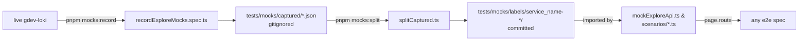

# E2E mocks

Static fixtures for every Loki API call the e2e suite makes. Tests run against
these fixtures via `mockExploreApi(page)` so they don't need a live backend.

> See [`tests/README.md`](../README.md#api-mocks) for the full architecture
> overview (layering model, scenario loaders, fixed snapshot time, common
> pitfalls). This file documents only the **record / split** workflow used to
> regenerate fixtures.

## Layout

```
tests/
├── fixtures/
│   ├── mockExploreApi.ts          # default scenario: registers page.route handlers
│   ├── captureExploreApiMocks.ts  # recorder utility (records → tests/mocks/captured/)
│   └── explore.ts                 # ExplorePage with captureQueries / blockAllQueriesExcept
├── recordExploreMocks.spec.ts     # walks every flow the suite needs
└── mocks/
    ├── README.md                  # this file
    ├── snapshotTime.ts            # SNAPSHOT_FROM_MS / SNAPSHOT_TO_MS
    ├── captured/                  # raw recordings — GITIGNORED, local-only
    ├── scripts/splitCaptured.ts   # transforms captured/ into labels/<group>-<name>/
    ├── scenarios/                 # per-test route loaders that layer on the default
    └── labels/
        ├── _global/                                # service-less queries
        ├── service_name-<svc>/                     # one folder per recorded service
        │   ├── index.ts                            # re-exports the slice
        │   ├── detectedLabels.ts
        │   ├── detectedFields.ts
        │   ├── labelValues.ts                      # Record<labelName, string[]>
        │   ├── fieldValues.ts                      # Record<fieldName, string[]>
        │   ├── patterns.ts
        │   ├── labelsBreakdown.json                # refId → byLabel → captured response
        │   └── dsQuery.json                        # captured /ds/query frames
        └── namespace-<ns>/                         # primary labels other than service_name
```

## Workflow



### 1. Record

Bring up a Grafana + Loki dev stack (`pnpm server`) so `gdev-loki` is reachable,
then run the recorder:

```bash
pnpm mocks:record
```

This walks every flow the suite needs (services index, per-service breakdowns,
embed page) and writes raw captures to `tests/mocks/captured/*.json`. To
capture a new flow, add a navigation block to
[`tests/recordExploreMocks.spec.ts`](../recordExploreMocks.spec.ts) before
running.

### 2. Split

```bash
pnpm mocks:split
```

[`splitCaptured.ts`](scripts/splitCaptured.ts) reads
`tests/mocks/captured/*.json`, extracts `service_name="..."` from each LogQL
expression or URL, and writes per-service files under
`tests/mocks/labels/service_name-<svc>/`. Service-less queries
(e.g. `service_name=~"a|b"`) land in `tests/mocks/labels/_global/`. New service
folders are created automatically — no allowlist to maintain.

The splitter is idempotent: running it twice produces the same output.

### 3. Update the snapshot time

Open [`snapshotTime.ts`](snapshotTime.ts) and update `SNAPSHOT_TO_MS` to the end
of the new capture window (peek at the `from`/`to` in the first request body of
`tests/mocks/captured/ds_query.json`) and `SNAPSHOT_FROM_MS` to 15 minutes
earlier. Every test reads these constants via
`tests/fixtures/explore.ts`, so the suite re-aligns with the new data
automatically.

### 4. Commit

Only `tests/mocks/labels/**` and any updates to `snapshotTime.ts` need to be
committed. `tests/mocks/captured/` is **gitignored** because `ds_query.json`
routinely exceeds GitHub's 100 MB single-file limit. The recorder treats it as
local-only intermediate state.

## Adding a new endpoint

When the plugin starts hitting a new Loki endpoint:

1. Add a recording bucket + route in
   [`tests/fixtures/captureExploreApiMocks.ts`](../fixtures/captureExploreApiMocks.ts)
   so the recorder writes a JSON file for it.
2. If it's per-service, add a writer in
   [`splitCaptured.ts`](scripts/splitCaptured.ts) that converts the captures
   into a per-service file.
3. Register the route handler in
   [`tests/fixtures/mockExploreApi.ts`](../fixtures/mockExploreApi.ts) using
   the imported data slice.
4. Re-run `pnpm mocks:record && pnpm mocks:split`.
